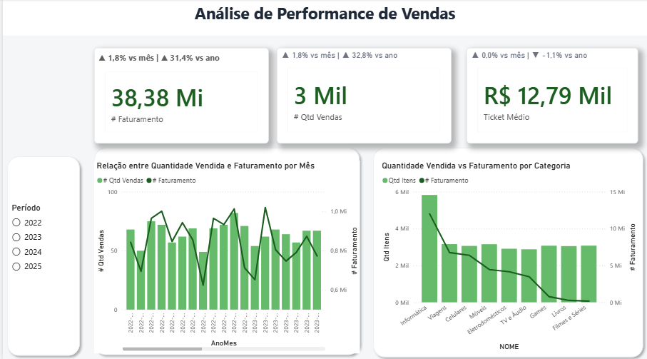
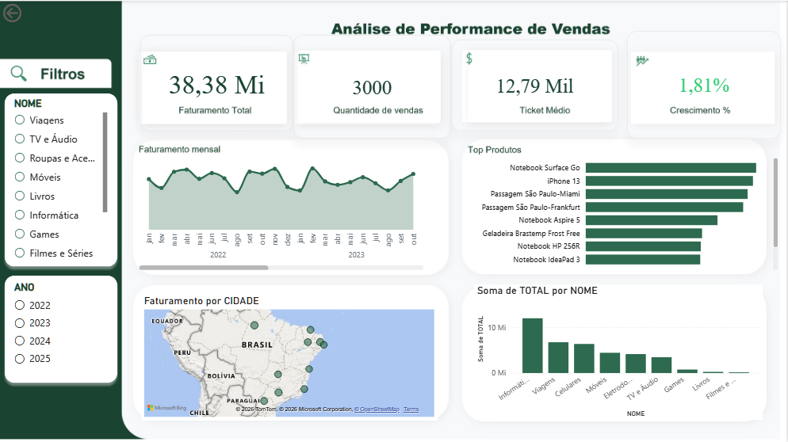

# Análise de Performance de Vendas (SQL + Power BI)

Este projeto tem como objetivo simular um cenário real de negócio, desenvolvendo uma solução completa de análise de dados, desde a modelagem até a visualização em dashboard.

# Destaque do Projeto

Dashboard desenvolvido com foco em análise de performance de vendas, combinando métricas de negócio, análise temporal e aprofundamento por categoria e produto.

O projeto permite identificar padrões entre volume de vendas e faturamento, auxiliando na tomada de decisão baseada em dados.

# Objetivo

Construir um dashboard interativo para análise de performance de vendas, permitindo acompanhar indicadores-chave e identificar padrões de comportamento dos dados.

# Tecnologias utilizadas
SQL Server
Power BI
DAX (Data Analysis Expressions)

# Modelagem de Dados

Foi construída uma estrutura relacional simulando um ambiente de vendas, contendo:

Clientes
Produtos
Categorias
Notas fiscais
Itens de venda

# Principais Métricas
Faturamento Total
Quantidade de Vendas
Ticket Médio
Crescimento (%) mensal e anual

# Análises Realizadas

## Análise temporal
Evolução do faturamento e volume de vendas ao longo do tempo, permitindo identificar tendências e variações no período.

## Comparação de métricas
Análise conjunta entre quantidade vendida e faturamento, evidenciando diferenças entre volume e valor agregado.

## Drill Down (Categoria → Produto)
Possibilita aprofundar a análise até o nível de produto, facilitando a identificação de itens mais relevantes.

# Dashboard Atual

# Evolução do Dashboard

Nesta versão foram implementadas melhorias importantes:

- KPIs com variação percentual mensal e anual  
- Gráfico comparativo (volume de vendas vs faturamento)  
- Implementação de drill down (categoria → produto)  
- Aplicação de layout corporativo  
- Melhor organização visual e leitura dos dados  

# Versão Anterior

# Estrutura do Projeto

- `SQL/` → scripts de criação, inserção e análise  
- `PROJETO BI.pbix` → dashboard no Power BI

# Como executar

1. Executar os scripts SQL para criação do banco  
2. Inserir os dados  
3. Rodar as consultas de análise  
4. Abrir o arquivo no Power BI

# Conclusão

O projeto demonstra a construção de uma solução de análise de dados completa, com foco em indicadores de negócio, visualização eficiente e capacidade de aprofundamento analítico.

# Acesso ao Projeto

[📥 Download do Dashboard (Power BI)](PROJETO BI.pbix)
